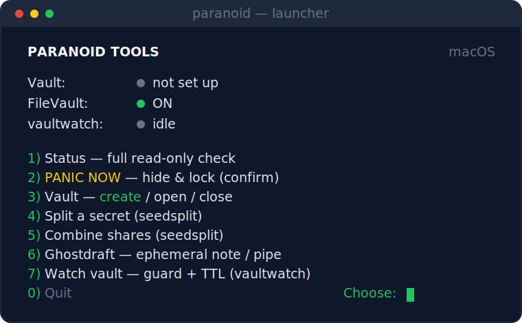

<div align="center">

**English** · [Русский](README.ru.md)


### Honest privacy &amp; security tools for macOS &amp; Windows — one job each, no snake oil.

[](LICENSE)
&nbsp;
&nbsp;
&nbsp;
&nbsp;

**[Manifesto](MANIFEST.md)** &nbsp;·&nbsp; **[Tools](#the-tools)** &nbsp;·&nbsp; **[Install](#install)** &nbsp;·&nbsp; **[Launcher](#the-launcher)**



</div>

> **Don't trust, verify.** Ed25519-signed releases · zero runtime dependencies · one
> auditable file per tool · shellcheck-clean. Every limitation is stated plainly — see each
> tool's *Scope &amp; limitations*. No third-party audit is claimed; the code is small enough
> to read yourself.

An umbrella of small command-line tools around the **lifecycle of a secret**
(seed phrase / password / key). Each tool is its own git repo — a single-file
script (pure Bash on macOS/Linux, a PowerShell port on Windows) with **zero
runtime dependencies** — and is honest about the limits of what it can guarantee.

## The tools

| # | Tool | Step in a secret's life | Platform | Latest |
|---|------|-------------------------|----------|--------|
| 1 | [`securetrash`](https://github.com/Di-kairos/securetrash) | store in an encrypted vault, then destroy | macOS · Windows (beta) | `v0.4.9` |
| 2 | [`vaultwatch`](https://github.com/Di-kairos/vaultwatch)   | guard a vault while it's open | macOS · Windows (beta) | `v0.1.4` |
| 3 | [`panic`](https://github.com/Di-kairos/panic)             | hide & lock everything, instantly | macOS · Windows (beta) | `v0.1.5` |
| 4 | [`ghostdraft`](https://github.com/Di-kairos/ghostdraft)   | write/view text leaving no disk trace | macOS · Windows (beta) | `v0.1.5` |
| 5 | [`seedsplit`](https://github.com/Di-kairos/seedsplit)     | split a secret into Shamir shares | macOS · Windows (beta) | `v0.3.3` |

> **Windows.** All five tools ship PowerShell ports (beta, Pester-tested in CI; seedsplit
> shares are byte-compatible with the macOS build). The macOS primitives — Spotlight, Time
> Machine, `launchd`, `hdiutil` — are mapped to their Windows equivalents (Windows Search,
> VSS, Task Scheduler, BitLocker), with the gaps reported honestly per tool.

Each tool ships an English `README.md` (Russian in `README.ru.md`), a
`CHANGELOG.md`, a checksum-verified and **Ed25519-signed** `install.sh`, CI +
release workflows, and a dedicated **Scope & limitations** section — read it
before you trust the tool.

## Install

One command installs all five tools plus the launcher into `~/.local/bin`:

```bash
git clone https://github.com/Di-kairos/paranoid-tools
cd paranoid-tools
bash install.sh            # installs all 5 + the paranoid launcher
bash install.sh --uninstall
```

On a fresh clone each tool is pulled from its own **signed release** with verify-then-run:
the installer checks the Ed25519 signature over `SHA256SUMS`, then the checksum of the
tool's own `install.sh`, and only then runs it — which in turn verifies the binary before
installing. Nothing executes until it has been verified. Pin a version with, e.g.,
`PT_PANIC_VERSION=0.1.5`; change the target dir with `PT_DEST=/usr/local/bin`.

Prefer to install just one tool, or inspect each step by hand? Every tool's README carries a
standalone verify-then-run snippet plus a one-line quick form. See [the tools](#the-tools).

### Updating

There is no `update` command — updating means **re-running the installer**. It pulls each
tool's latest signed release and overwrites the binary in place:

```bash
cd paranoid-tools
git pull            # refresh the clone (launcher + installer)
bash install.sh     # reinstall all tools at their latest signed releases
```

Check a tool's version with `securetrash version` (or `--version` on any tool). If a tool's
runtime behavior changed in the update (e.g. `securetrash vault` now mounts the volume
visibly in Finder), an already-open session keeps the old code — reopen it: `securetrash
vault close` then `securetrash vault open`.

Usage guides: **[English](GUIDE.md)** · [Русский](ИНСТРУКЦИЯ.md).

## The launcher

`paranoid` is an interactive launcher — a status dashboard plus a menu — over the
five CLIs. Pure Bash, zero dependencies, just like the tools it drives.

It holds no secrets and adds no crypto of its own: it runs the same signed tools
and shows their output — *Scope & limitations* and `check` verdicts included —
unaltered. Run it with no arguments:

```bash
paranoid          # opens the dashboard + menu
```

Honest note: the launcher is for convenience, not real-panic-speed. For an instant,
system-wide panic key, use `panic hotkey install` (a global hotkey via skhd — see panic's
README). An open vault is always flagged "at risk".
A Windows PowerShell mirror now ships at `windows/paranoid.ps1` (beta) — run it with
`pwsh -File windows/paranoid.ps1` (or drop it on PATH as `paranoid`); it drives the
same five PowerShell ports.

## How it fits together

- **Separate repos + vendoring.** The shared code is the canonical
  `securetrash/lib/common.sh`, vendored inline into each tool between
  `# === BEGIN vendored common (pin: <ref>) ===` markers. A sync script + a CI
  drift check keep copies honest. No runtime dependency, no build step.
- **Vault hooks.** `securetrash vault open/close` fire
  `~/.securetrash/hooks/{post-open,post-close}`; `vaultwatch`/`panic` hook into
  the container's lifecycle through them.
- **The ecosystem law.** One tool = one job. Every README must carry an honest
  *Scope & limitations* section. Never manufacture a false sense of security.

## License

[MIT](LICENSE). Each tool repo carries its own MIT `LICENSE`, plus `SECURITY.md`
(how to report a vulnerability privately) and `CONTRIBUTING.md`.
