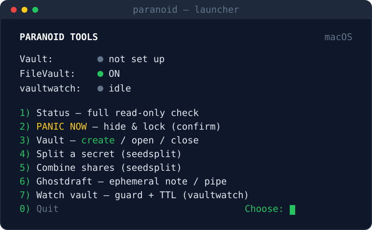

<div align="center">

**English** · [Русский](README.ru.md)


### Honest privacy &amp; security tools for macOS &amp; Windows — one job each, no snake oil.

[](LICENSE)
&nbsp;
&nbsp;
&nbsp;
&nbsp;

**[Guide](GUIDE.md)** &nbsp;·&nbsp; **[Manifesto](MANIFEST.md)** &nbsp;·&nbsp; **[Threat model](THREAT-MODEL.md)** &nbsp;·&nbsp; **[Tools](#the-tools)** &nbsp;·&nbsp; **[Install](#install)** &nbsp;·&nbsp; **[Launcher](#the-launcher)**


</div>

Five small command-line tools around the **lifecycle of a secret** — a seed phrase, a
password, a key: write it without leaving copies, store it encrypted, guard it while
it's open, hide everything instantly under threat, split it into paper shares that
survive a typo. Each tool is a single auditable file — pure Bash on macOS, a
PowerShell port on Windows — with zero runtime dependencies, living together in this
repository. **Not a password manager**: a local toolkit for the few secrets whose
leak you can't undo. No cloud, no telemetry, no promises it can't keep.

## Install

**macOS** — one command installs all five tools plus the launcher into `~/.local/bin`:

```bash
git clone https://github.com/Di-kairos/paranoid-tools
cd paranoid-tools
bash install.sh            # installs all 5 + the paranoid launcher
```

**Windows** (beta) — PowerShell 7 and Git once, then the same single command. Any
terminal will do: `cmd`, the built-in Windows PowerShell, or PowerShell 7.

```powershell
winget install --id Microsoft.PowerShell -e
winget install --id Git.Git -e
# open a NEW terminal window here — winget gives its PATH to new processes only
git clone https://github.com/Di-kairos/paranoid-tools
cd paranoid-tools
windows\install.cmd            # installs all 5 + the paranoid launcher
```

**Then, on either system:** open a **new** terminal (so `PATH` picks up the change) and
run `paranoid` — one menu with the current state of everything and every action in it, so
you do not have to learn five CLIs to start. Step-by-step Windows notes (installing
without Git, one tool only, what to do when `git` is "not recognized") are in
**[Windows](#windows)** below.

Each tool is pulled from its own **signed release** with verify-then-run: the installer
checks the Ed25519 signature over `SHA256SUMS`, then the checksum of the tool's own
`install.sh`, and only then runs it — which in turn verifies the binary before
installing. Every artifact pulled from the network is verified before it runs. Two
things are not network artifacts and are therefore not covered by that sentence: the
top-level `install.sh` (you launch it yourself, after reading it) and the `paranoid`
launcher, which is installed straight from the clone in front of you — both are part of
the repository you can read, not downloads.

There is also a signed and notarized **[macOS menu-bar app](#the-macos-app-menu-bar)**,
and a **[Windows path](#windows)** (PowerShell 7). Homebrew covers `securetrash` today
(`brew install Di-kairos/tap/securetrash`).

## The tools

| # | Tool | Step in a secret's life | Platform | Latest |
|---|------|-------------------------|----------|--------|
| 1 | [`securetrash`](securetrash/) | store in an encrypted vault, empty or destroy it | macOS · Windows (beta) | [](https://github.com/Di-kairos/paranoid-tools/releases) |
| 2 | [`vaultwatch`](vaultwatch/)   | guard a vault while it's open — **early, work in progress** | macOS · Windows (beta) | [](https://github.com/Di-kairos/paranoid-tools/releases) |
| 3 | [`panic`](panic/)             | close vaults, detach volumes, clear the clipboard, lock the screen — instantly | macOS · Windows (beta) | [](https://github.com/Di-kairos/paranoid-tools/releases) |
| 4 | [`ghostdraft`](ghostdraft/)   | write/view text without leaving copies in the usual places — **early** | macOS · Windows (beta) | [](https://github.com/Di-kairos/paranoid-tools/releases) |
| 5 | [`seedsplit`](seedsplit/)     | split a secret into Shamir shares — paper shares survive a typo or two (+ passphrase on macOS) | macOS · Windows (beta) | [](https://github.com/Di-kairos/paranoid-tools/releases) |

All five tools live in this repository (one directory each, full history preserved),
version independently, and release independently under `<tool>-vX.Y.Z` tags. Each ships
an English `README.md` (Russian in `README.ru.md`), a `CHANGELOG.md`, a
checksum-verified and **Ed25519-signed** `install.sh`, its own CI, and a dedicated
**Scope &amp; limitations** section — read it before you trust the tool. Everything a
user reads to operate the tools — READMEs, `GUIDE.md`, the CLI output itself — exists in
both English and Russian. The changelogs and `docs/RELEASE-STATE.md` are release notes
written in Russian; what they describe is in the English docs, and `git log` is English
throughout.

> **Windows.** All five tools ship PowerShell ports (beta, Pester-tested in CI; seedsplit
> shares are byte-compatible with the macOS build). The macOS primitives — Spotlight, Time
> Machine, `launchd`, `hdiutil` — are mapped to their Windows equivalents (Windows Search,
> VSS, Task Scheduler, BitLocker), with the gaps reported honestly per tool.

## Don't trust, verify

Ed25519-signed releases · zero runtime dependencies (two opt-in exceptions, named in the
install notes) · one auditable file per tool · shellcheck-clean. Every limitation is
stated plainly — see each tool's *Scope &amp; limitations*. **No third-party audit is
claimed** — but the whole thing is ~4,800 lines of shell across seven scripts, so reading
it yourself is a weekend, not a project.

**Verify the releases yourself.** `bash verify-releases.sh` downloads the published
release of every tool and checks each Ed25519 signature and checksum against the key
pinned in this repo — all four signed files of each release (the tool, its PowerShell
twin and both installers), because an installer nobody verifies is the same hole as an
unverified tool. Anything that did not download is a failure, never a pass. It installs
nothing and needs nothing but `curl` and `ssh-keygen`.
That is the claim in the heading, executable. More on what is tested and how:
[docs/TESTING.md](docs/TESTING.md).

**The cryptography is honest about itself.** `seedsplit` implements Shamir over GF(256)
in pure Bash — our own implementation, **not independently audited**, and log/antilog
multiplication is not constant-time (stated in its README). What stands in for an audit
today: CI differentially tests it on every push against a second, from-scratch
implementation in another language written to the same spec — shares split here must
combine there and vice versa — plus property tests for the threshold, set mixing, and
Reed-Solomon typo repair, with the field arithmetic anchored to published FIPS-197
vectors. That catches implementation mistakes, not scheme flaws, and it is not a
third-party review. The boundary is written where you can read it:
[seedsplit → Scope &amp; limitations](seedsplit/README.md#scope--limitations).

Whether this toolkit fits your case — and what it will **not** protect you from — is
spelled out in the **[threat model](THREAT-MODEL.md)**. It closes the gap between your
password manager, disk encryption, and a paper backup — it does not replace any of them.

### Install-time switches and edges

Named before you find them: `ALLOW_UNSIGNED_LEGACY=1` deliberately downgrades
verification to hash-only — it exists for pre-signing releases; `PT_ALLOW_PARTIAL=1`
lets a run finish when some tools failed to install. Maintainers can install straight
from the working copy with `PT_DEV=1` — that path skips release verification and says so
in its output; without the flag every install goes through signed releases, clone or no
clone. The Windows installers carry the same idea under a different name:
`PT_ALLOW_HASH_ONLY=1`. The zero-dependency claim has two opt-in exceptions:
`panic hotkey` needs `skhd`, `seedsplit -p` needs `openssl` (both stated in the tool
READMEs) — and on Windows the port itself runs on PowerShell 7, the one platform
prerequisite. Pin a tool's version with `PT_ST_VERSION` / `PT_VW_VERSION` /
`PT_PANIC_VERSION` / `PT_GHOSTDRAFT_VERSION` / `PT_SEEDSPLIT_VERSION` (any other
spelling is ignored silently); change the target dir with `PT_DEST=/usr/local/bin`.

**Linux.** `install.sh` refuses to run there, and that is deliberate rather than an
oversight: securetrash, vaultwatch, panic and ghostdraft are built on macOS primitives
(`hdiutil`, `fdesetup`, `mdutil`, `tmutil`, `launchd`) with no Linux equivalents that
would keep the same honesty about what is guaranteed. A LUKS/systemd port would be a
different tool, not a flag. `seedsplit` is the exception — pure arithmetic over POSIX
utilities; it runs anywhere Bash does.

Prefer to install just one tool, or inspect each step by hand? Every tool's README
carries a standalone verify-then-run snippet plus a one-line quick form. Note those
per-tool installers default to `/usr/local/bin` (and ask for sudo), while this one
installs into `~/.local/bin` — if you use both, you end up with two copies and `PATH`
decides which one runs. Set `PT_DEST` or the tool's own destination variable to keep
them in one place.

### The macOS app (menu bar)

`ParanoidBar.app` is a menu-bar front end for the five CLIs — it runs them, it does not
replace them, and it is useless without them, so install the tools above first. Download
the image from the [GUI release](https://github.com/Di-kairos/paranoid-tools/releases/tag/gui-v0.1.0),
open it, drag the app onto `/Applications`:

```bash
curl -LO https://github.com/Di-kairos/paranoid-tools/releases/download/gui-v0.1.0/ParanoidBar-0.1.0.dmg
shasum -a 256 ParanoidBar-0.1.0.dmg
# da80707bb0e63a9deb3a05a0387ef64b75db6b6d2c28c25a5170d293b445b00a
```

It is signed with a Developer ID certificate and notarized by Apple, ticket stapled — so
it opens without the "unidentified developer" dance, and Gatekeeper accepts it
**offline**, on a machine that has never seen it. Verify that yourself before you run it:

```bash
spctl --assess --type open --context context:primary-signature ParanoidBar-0.1.0.dmg
#   → accepted, source=Notarized Developer ID
xcrun stapler validate ParanoidBar-0.1.0.dmg
```

Unlike the CLI releases, the image carries no Ed25519-signed `SHA256SUMS`: that key signs
artifacts built in CI, and this one has to be built on the machine holding the Apple
signing key. Apple's signature and the stapled ticket are the chain you verify here —
plus the checksum above, and the source, which builds the same image with
`gui/macos/build.sh`. The app is a menu-bar agent: no Dock icon, a glyph appears at the
right of the menu bar. macOS 13+.

**Windows tray:** not signed yet (Authenticode is a separate purchase from a commercial
CA), so it ships as source only — run it from a clone, see [gui/README.md](gui/README.md).

### Uninstall

```bash
bash install.sh --uninstall                 # macOS: remove all tools and the launcher
```

```powershell
windows\install.cmd -Uninstall             # Windows: the same, PATH entry included
```

Neither one touches your data: vaults, notes and shares stay exactly where they are.

### Windows

The short path is at the top of [Install](#install) — this section is the same thing
spelled out, plus the things that trip people up. Step **1 you do once**.

Which terminal you use does not matter: `cmd`, the built-in Windows PowerShell 5.1 and
PowerShell 7 all work. The tools run on PowerShell 7 under the hood, and the `.cmd` shim
on your PATH starts it for them — you never have to pick a shell or touch your
ExecutionPolicy.

**1. Install PowerShell 7 and Git.** Press `Win`, type "PowerShell", Enter, and run:

```powershell
winget install --id Microsoft.PowerShell -e
winget install --id Git.Git -e
```

Then **open a new terminal window**. `winget` hands the new PATH to new processes only,
so in the window you installed from, `git` stays "not recognized as the name of a
cmdlet". If you would rather keep the window, refresh its PATH by hand:

```powershell
$env:Path = [Environment]::GetEnvironmentVariable('Path','Machine') + ';' +
            [Environment]::GetEnvironmentVariable('Path','User')
```

*Without Git:* open the repository page, **Code → Download ZIP**, unpack it, and start
from step 2 in the unpacked folder. Nothing else changes — the tools themselves are
pulled from their signed releases either way.

**2. Install the tools.** All five live in this repository — clone once, then one command
installs all of them plus the `paranoid` launcher, the same way `install.sh` does on macOS:

```powershell
cd $HOME            # clone into your own profile, not C:\WINDOWS\system32
git clone https://github.com/Di-kairos/paranoid-tools
cd paranoid-tools
windows\install.cmd
```

The umbrella installs nothing by itself: it runs each tool's own `windows/install.ps1`,
and that one downloads the signed release and **verifies its Ed25519 signature and
checksum before installing anything** (and refuses to install if either fails). What the
umbrella adds is one shared directory — `%LOCALAPPDATA%\Programs\ParanoidTools`
(override with `PT_INSTALL_DIR`) — and a single PATH entry instead of five. A tool that
refuses to install is reported and the run exits non-zero; `PT_ALLOW_PARTIAL=1` accepts a
partial install.

Want just one tool? Install it on its own — the per-tool installer puts it into
`%LOCALAPPDATA%\Programs\<tool>` and edits PATH itself:

```powershell
cd paranoid-tools\securetrash
pwsh -NoProfile -ExecutionPolicy Bypass -File windows\install.ps1
```

**3. Use it.** Open a **new** terminal window (so the PATH change takes effect), then
call the tools by name:

```powershell
paranoid            # the interactive launcher
securetrash version
securetrash --help
```

**Administrator rights: what needs them, and what that costs you.** The vault is a
BitLocker-encrypted VHDX, and Windows hands both `diskpart` and the BitLocker cmdlets to
administrators only. So `securetrash vault create/open/close/destroy/reset`, `vaultwatch start`
and the volume-locking half of `panic now` cannot run as a normal user; everything else
(`check`, `status`, `shred`, `seedsplit`, `ghostdraft`, the clipboard and screen-lock half of
`panic`) can.

From the `paranoid` launcher you do not have to think about it: pick one of those actions in a
normal console and Windows raises its own rights prompt — one click, and the action runs in its
own window, where you type the vault password. Decline it and nothing happens, which the
launcher says out loud. The dashboard's `Admin:` line tells you which console you are in before
you pick anything.

Running the tools directly (not through the launcher) keeps the plain rule: an unelevated vault
command refuses without touching anything and names the console it needs, and `securetrash
check` reports up front whether this console can run the vault at all. This is a Windows
privilege boundary, not a choice of ours — nothing here asks for rights it does not need, and
nothing runs elevated behind your back.

Each name on your PATH is a small `.cmd` shim in
`%LOCALAPPDATA%\Programs\ParanoidTools`; the scripts themselves sit in the `lib\`
subdirectory next to it. That is deliberate: PowerShell resolves a bare command name to a
`.ps1` on PATH before a `.cmd` of the same name, and the default ExecutionPolicy then
refuses to load it — so a `.ps1` on PATH is exactly what turns `paranoid` into "cannot be
loaded because running scripts is disabled on this system". The shim starts
`pwsh -ExecutionPolicy Bypass` for its own process only; your machine's policy is never
changed, and nothing else on the system becomes runnable.

To update later, the launcher's **Update** item (6) re-runs the installer from your clone —
it pulls the sources with `git pull --ff-only` and then installs, so the signature check stays
on the one path it has always been on. By hand it is the same two commands: `git pull` in the
clone, then `windows\install.cmd`.

To remove everything, including the PATH entry: `windows\install.cmd -Uninstall`.

> **Beta.** The Windows ports are logic-tested in CI but not yet broadly validated on
> real hardware — try them on non-critical data first before trusting them with real
> secrets.

### Release signing — honest scope

**In short:** the signature protects the delivery channel, but one key covering all five
tools is a shared point of risk.

Releases are signed with a **single Ed25519 key** shared across all five tools. Be aware
of the trade-off: compromise of that key (its GitHub Actions secret, or a malicious
change to `release.yml`) would let an attacker sign a forged release for the **whole
ecosystem**, and the public key is pinned in the installers so there is no in-band
revocation today. The signature still defeats an attacker who only controls the download
path (mirror, CDN, MITM) — which is the common case. Hardening this to **per-tool keys /
OIDC-based signing with a documented rotation &amp; revocation path** is tracked work, not
yet shipped. If you need maximum assurance, pin an exact version and check its
`SHA256SUMS` against an independent copy.

### Updating

There is no `update` command — updating means **re-running the installer**. It pulls each
tool's latest signed release and overwrites the binary in place:

```bash
cd paranoid-tools
git pull            # refresh the clone (launcher + installer)
bash install.sh     # reinstall all tools at their latest signed releases
```

Check a tool's version with `securetrash version` (or `--version` on any tool). If a
tool's runtime behavior changed in the update (e.g. `securetrash vault` now mounts the
volume visibly in Finder), an already-open session keeps the old code — reopen it:
`securetrash vault close` then `securetrash vault open`.

**Staying notified.** There's no telemetry and nothing phones home, so a new version
won't find you — you check for it. Cheapest and privacy-clean: on GitHub press **Watch ▸
Custom ▸ Releases** on [paranoid-tools](https://github.com/Di-kairos/paranoid-tools) —
GitHub emails you on every release. The **Latest** badges in the tools table always show
the current release; compare them with your local `<tool> version`. Installed a tool via
Homebrew? `brew upgrade` picks up the new formula. The `paranoid` launcher also shows an
opt-in "update available" line on its dashboard — see [The launcher](#the-launcher).

Usage guides: **[English](GUIDE.md)** · [Русский](ИНСТРУКЦИЯ.md).

## The launcher

`paranoid` is an interactive launcher — a status dashboard plus a menu — over the five
CLIs. Pure Bash, zero dependencies, just like the tools it drives. The menu is grouped
into submenus — **Vault** (open/close · empty · destroy · watch), **Notepad**
(ghostdraft), **Secrets** (seedsplit) — with *Status* and one-key *PANIC* kept at the
top. **Empty** crypto-shreds the vault's contents and hands you a fresh empty one (a
real guarantee, unlike wiping files in place on an SSD).

<div align="center">

</div>

It holds no secrets and adds no crypto of its own: it runs the tools you installed and
shows their output — *Scope &amp; limitations* and `check` verdicts included — unaltered.
To be precise about what "signed" covers: signatures are verified **at install time**.
At runtime the launcher and the GUI simply call `securetrash`, `panic` and the rest by
name, i.e. whatever your `PATH` resolves them to — they do not re-verify on every
launch. Anyone who can write to a directory earlier in your `PATH` can put something
else there, and no tool here would notice. Run it with no arguments:

```bash
paranoid          # opens the dashboard + menu
```

Honest note: the launcher is for convenience, not real-panic-speed. For an instant,
system-wide panic key, use `panic hotkey install` (a global hotkey via skhd — see
panic's README). An open vault is always flagged "at risk". A Windows PowerShell mirror
ships at `windows/paranoid.ps1` (beta); `windows\install.cmd` puts it on your PATH as
`paranoid`, and it drives the same five PowerShell ports.

**Opt-in update check.** Off by default — nothing on the dashboard touches the network
unless you ask. Set `PARANOID_UPDATE_CHECK=1` and the dashboard adds an *"update
available"* line when an installed tool has a newer signed release. It's the only
network call the launcher makes: one fetch of the repository's public `releases.atom`
feed covering all five tools (no API key, no telemetry), cached for 24h. Enable it for a session
with `PARANOID_UPDATE_CHECK=1 paranoid`, or export it in your shell rc to keep it on.

## How it fits together

- **One repository, five independent tools.** Each tool versions and releases on its
  own `<tool>-vX.Y.Z` tag, with its own CI. The shared code is the canonical
  `securetrash/lib/common.sh`, vendored inline into each tool between
  `# === BEGIN vendored common (pin: <ref>) ===` markers — a sync script + a CI drift
  check keep the copies honest, so every tool stays a single self-contained file. No
  runtime dependency, no build step.
- **Vault hooks.** `securetrash vault open/close` fire
  `~/.securetrash/hooks/{post-open,post-close}`; `vaultwatch install-hooks` wires the
  guard into the container's lifecycle through them. (`panic` stays hook-free on
  purpose: it must work even when nothing else is set up.)
- **The ecosystem law.** One tool = one job. Every README must carry an honest
  *Scope &amp; limitations* section. Never manufacture a false sense of security.

## How it's built

The verification story here never depended on trusting the author: CI on
three shells (bash, pwsh 7, Windows PowerShell 5.1), ~900 tests (bats + Pester)
including known-answer vectors and a differential cross-check of the crypto against an
independent implementation, shellcheck-clean sources, Ed25519-signed releases you can
verify with one script, and code short enough to read. Trust the checks, not the
biography.

## Support

Paranoid Tools is free and open-source (MIT). If it saved you from a leak — or you just
want the work to continue — you can support it via
**[GitHub Sponsors](https://github.com/sponsors/Di-kairos)**. No paywalls, no telemetry,
no upsell — and that covers the GUI too: the native menu-bar / tray layer is free and
stays free, like everything else here. Sponsorship funds maintenance, nothing is sold.

## License

[MIT](LICENSE). This repository carries [`SECURITY.md`](SECURITY.md) (single private
reporting channel for everything here) and [`CONTRIBUTING.md`](CONTRIBUTING.md); each
tool directory carries its own MIT `LICENSE` and `CONTRIBUTING.md`.
